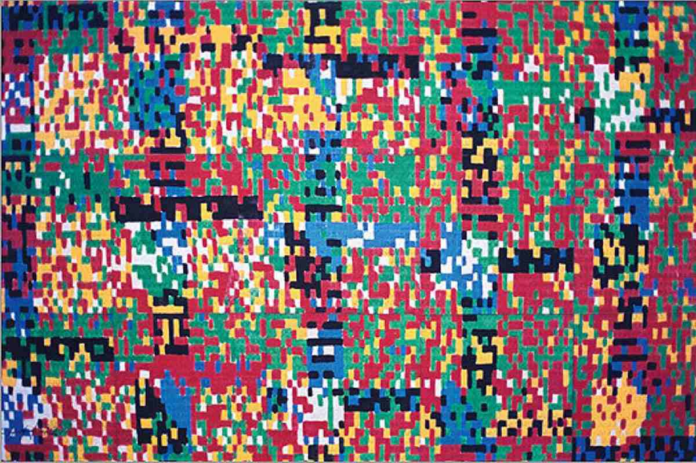

# Art.AI

## Project Description

The goal of our project is to train a neural network to apply the style of one image to another image. The network will be trained on a large dataset of style images and content images, and it will learn to transfer the style of the style image to the content image. The resulting model will be capable of transforming a simple photo into a masterpiece painting, for example. To add on to this, we want to train a Generative Adversarial Network (GAN) to take the style of one image and generate new images in the same style. The model will be capable of generating new images that are similar in style to the images in the training set.

## Project Goals

1. Collect a large dataset of style images and content images
2. Train a neural network to transfer the style of a style image to a content image
3. Train a GAN on the collected dataset 
4. Evaluate the quality of the generated images using standard metrics
5. Compare the results to other state-of-the-art models for style transfer
6. Explore the potential of using the model for applications such as creating custom art pieces or enhancing the visual appeal of existing photos or videos
