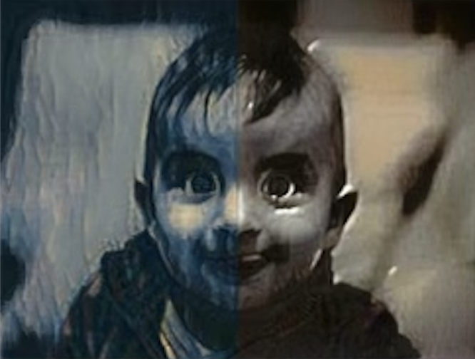

# Art.AI

**Team members:** Maika Nishiguchi, Seho Kwak, and Rachel Yang

## Introduction & Related Works
Neural style transfer is a captivating and rapidly expanding area of research in computer vision and graphics. This technique involves transferring the style from one image to another, essentially blending the content of a target image with the style of a source image. The process can be viewed as a texture transfer problem, where the goal is to synthesize a texture from the source image while preserving the semantic content of the target image.

A successful style transfer algorithm should extract the semantic content of the target image, such as objects and general scenery, and use this information to guide a texture transfer process that renders the content in the style of the source image. This requires the algorithm to (1) recognize objects in the target image and (2) recombine the objects and style of the source image.

Convolutional neural networks (CNNs) have emerged as the most popular method for achieving this task. Gatys et al. (2016) demonstrated the use of image representations from CNNs optimized for object recognition to transfer the style of a reference image onto an input target image. Similarly, Li et al. (2021) explored how CNNs can be applied to process 2-D images, including object detection and image classification. Luan et al. (2017) built upon this approach by augmenting the algorithm to achieve more photorealistic style transfer while minimizing distortion. Additionally, Kotovenko et al. (2019) introduced a content transformation module between the encoder and decoder to reduce extra deformations, additions, and deletions of content details, learning how style influences content details and generalizing this to other class details.

For our project, we will use baby photos from the dataset https://www.kaggle.com/datasets/cocowaffle/baby-photos as content images and famous artworks from https://www.kaggle.com/datasets/ikarus777/best-artworks-of-all-time as style images. We will start by replicating the neural style transfer tutorial available at https://pytorch.org/tutorials/advanced/neural_style_tutorial.html and adjust the parameters to train our model using the chosen datasets. Our primary focus will be on baby photos, applying different art styles to these images.

Our goal is to split one photo in half, applying two different art styles to each half of the image. We will experiment with blending multiple styles into the output image and apply each style to different regions of the image.

## Methods

We employed PyTorch as the primary software for our neural network implementation, taking advantage of its flexibility and efficiency in building and training models. Using the baby photos dataset (https://www.kaggle.com/datasets/cocowaffle/baby-photos) as our content images and the best artworks dataset (https://www.kaggle.com/datasets/ikarus777/best-artworks-of-all-time) for style images, we created a unique dataset tailored to our project's goals.

A convolutional neural network (CNN) served as the core of our model, as it is adept at identifying patterns and features in images, which is crucial for recognizing different art styles. Our inputs consisted of three-channel images represented as matrices of pixel values, which the model used to extract content and style information.

The output of our neural style transfer model was a visually appealing image that fuses the style of two different images with the content of a baby photo. This three-channel image, with the same shape and type as the input image, was intended to produce an aesthetic result rather than serve any specific classification, regression, or segmentation task.

We succeeded in running the PyTorch tutorial code with baby photos and artworks, making our project unique by modifying the code so that we can create an output image where each half has a different style. 

1. Load the content and style images using the ‘Image.open’ function from the Python Imaging Library (PIL). Resize the images to the desired dimensions using the ‘transforms.Resize’ function from the PyTorch ‘transforms’ module.
2. Preprocess the images by normalizing the pixel values for each color channel (Red, Green, and Blue) and converting the images to tensors using the ‘transforms.ToTensor’ function. The normalization is necessary because neural networks in the PyTorch library are trained with tensor values ranging from 0 to 1.
3. Initialize the CNN architecture with pre-trained weights by following the tutorial's guidelines. In this case, the architecture used is VGG19, a pre-trained convolutional neural network that has proven to be effective for style transfer tasks. Load the VGG19 model using the ‘torchvision.models.vgg19’ function, and extract the necessary layers to compute the content and style features.
4. Define the content and style loss functions using the ‘nn.Module’ class from PyTorch. The content loss function quantifies how well the content is preserved in the generated image, while the style loss function measures the preservation of style. The functions are computed based on the Gram matrix, which is used to capture the style information from the style image.
5. Initialize two input images (one for each half of the final output) as tensors to be optimized during the process. The two input images will be optimized separately to generate the style-transferred halves of the content image.
6. Optimize the input images iteratively using the L-BFGS optimization algorithm provided by PyTorch's ‘torch.optim’ module. Adjust the pixel values of the input images to minimize the combined content and style losses.
7. Modify the tutorial code to include the blending function, which combines the two style-transferred halves of the content image into a single output image. This blending can be achieved using the ‘paste()’ function from the PIL library, pasting one half onto the other.
8. Postprocess the optimized image by converting the tensor back to a PIL image, and then de-normalizing the pixel values to the original range (0-255). The final image can be saved or displayed using the PIL library.

'''
    for baby in baby images:
        content_image = Image.open(baby)
      
        left_half, right_half = split_image(content_image)
        left_img = content_image_loader(left_half)
        right_img = content_image_loader(right_half)
      
        input_left_img = left_img.clone()
        input_right_img = right_img.clone()
        
        style_left = run_style_transfer(cnn, cnn_normalization_mean, cnn_normalization_std, left_img, style_img_1, input_left_img)
        style_right = run_style_transfer(cnn, cnn_normalization_mean, cnn_normalization_std, right_img, style_img_2, input_right_img)
'''

## Discussion
In this project, we aimed to create a unique application of neural style transfer by blending two different art styles in each half of a baby photo. We started with the PyTorch neural style transfer tutorial, which uses a pre-trained convolutional neural network (CNN) architecture to transfer the style of a reference image onto an input target image. We then modified the code to achieve our specific goal, as outlined below.

1. Load the content and style images, resizing them to the desired dimensions using the provided image resizing function.
2. Preprocess the images, normalizing pixel values and converting them to tensors, as per the tutorial's instructions.
3. Initialize the CNN architecture with pre-trained weights following the tutorial's guidelines.
4. Define the content and style loss functions, which quantify how well the content and style are preserved in the generated image, as described in the tutorial.
5. Initialize two input images for each half of the final output, either with random noise or the content image, to be optimized during the process.
6. Optimize the input images iteratively, adjusting their pixel values to minimize the combined content and style losses, following the tutorial's optimization procedure.
7. Modify the tutorial code to include the blending function provided earlier, which combines the two style-transferred halves of the content image into a single output image.
8. Postprocess the optimized image, converting it back to its original format and size, as instructed in the tutorial.

Our results demonstrate the visual appeal and effectiveness of combining two different art styles in one image, applied to baby photos. In the upcoming complete draft, we will assess the quality of the style transfer, the preservation of content, and the blending of the two styles in the output images by visually comparing them to the original content and style images. We will include example images within the discussion section to support our evaluation. Additionally, we will compare our work to the original neural style transfer algorithm and other variations, highlighting any improvements or unique features in our approach, such as the ability to blend two styles seamlessly in a single output image. This comparison will be further refined and substantiated in the complete draft, providing a thorough and convincing analysis of our project's results.

By building upon the PyTorch tutorial and incorporating custom datasets for content and style images, we have contributed to the growing body of research in neural style transfer and demonstrated the potential of exploring diverse applications in this area.

## Ethics Discussion

While our project focuses on the artistic aspect of neural style transfer, it is essential to consider the ethical implications that may arise from using this technology. One area of concern is the potential for copyright infringement when using and modifying existing artworks or photographs. As we utilize famous artworks from various artists for our style images, we must ensure that we are respecting their intellectual property rights and acknowledging their contributions. It is also crucial to obtain permission from the owners of the baby photos used as content images, as these images involve personal data and may be subject to privacy concerns.

Another ethical consideration is the potential misuse of neural style transfer for creating misleading or manipulative images. By blending different styles and altering the content of an image, the technology could be exploited to generate deceptive or malicious content, such as deepfake images or misinformation. It is the responsibility of researchers and developers to create guidelines and implement safeguards to prevent such misuse of the technology.

Lastly, it is crucial to consider the cultural implications of blending artistic styles from different origins. The merging of styles from various cultures and time periods could be seen as a celebration of diversity and creativity. However, it is essential to approach this process with cultural sensitivity, ensuring that the final output does not inadvertently misrepresent or appropriate cultural elements in a disrespectful manner. By considering these ethical concerns, we aim to contribute to the responsible development and application of neural style transfer technology.

## Reflection
Reflecting on our work, there are a few things we would do differently next time. First, we would explore additional methods for blending multiple styles in the output image, such as incorporating more sophisticated algorithms or incorporating the use of deep learning techniques. This could potentially lead to more visually appealing results and better preservation of content and style.

Furthermore, we would like to expand our project by exploring other applications of neural style transfer beyond baby photos. There are many potential avenues for research, such as applying neural style transfer to video or 3D models, which could lead to exciting new developments in the field.

In future work, we would also consider comparing the performance of different neural network architectures, such as ResNets, YOLO, Inception, and custom models, to determine which is most suitable for our particular application. This could involve comparing different sets of hyperparameter values, frameworks (e.g., PyTorch, TensorFlow), and even creating an application for our final model.

Overall, our project demonstrates the potential of neural style transfer for creating visually appealing images with unique artistic combinations. By building on existing research and exploring new applications, we contribute to the growing body of knowledge in this exciting field.
